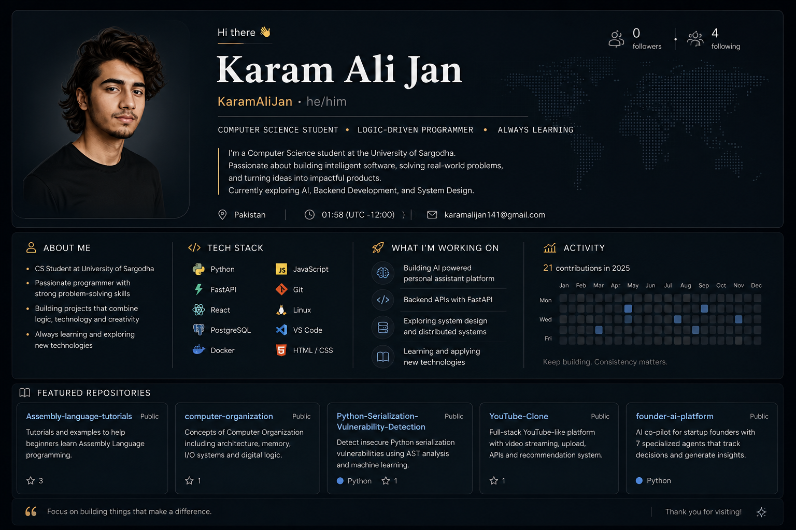

---

## About Me

I'm a Computer Science student at the **University of Sargodha** with a strong interest in building software that solves real problems.

My current focus is on **Artificial Intelligence, backend engineering, and system design**. I enjoy going beyond simply using technologies — I want to understand how the systems behind them work and build them myself.

Currently, I'm exploring **LLMs, AI agents, APIs, databases, and full-stack applications** while strengthening my foundations in computer science.

> **Learn deeply. Build consistently. Solve meaningful problems.**
## Current Focus

| Area | What I'm Working On |
|---|---|
| 🤖 AI | LLMs, AI agents, embeddings & intelligent systems |
| ⚙️ Backend | FastAPI, APIs, authentication & databases |
| 🗄️ Data | PostgreSQL, vector databases & semantic search |
| 🧠 CS Foundations | Algorithms, operating systems & system design |
| 🚀 Building | Turning ideas into working products |
## Currently Building

### FounderOS
An AI-powered platform designed to help founders make better decisions, manage ideas, detect contradictions, and maintain long-term context using specialized AI agents.

**Stack:** Python · FastAPI · PostgreSQL · React · Docker · LLMs
---

## Featured Projects

<table>
<tr>
<td width="50%">

### 🤖 FounderOS

AI-powered co-pilot for startup founders using specialized AI agents to help with decisions, planning, contradictions, and persistent memory.

**Python · FastAPI · React · PostgreSQL · LLMs**

[View Repository →](https://github.com/KaramAlijan/founder-ai-platform)

</td>

<td width="50%">

### 🎥 YouTube Clone

Full-stack video streaming platform with video uploads, streaming, REST APIs, authentication, and content-based recommendations.

**React · FastAPI · PostgreSQL**

[View Repository →](https://github.com/KaramAlijan/YouTube-Clone)

</td>
</tr>

<tr>
<td width="50%">

### 🔐 Serialization Vulnerability Detection

A Python security project for detecting insecure serialization and deserialization patterns using AST-based static analysis and machine learning.

**Python · AST · Machine Learning · Security**

[View Repository →](https://github.com/KaramAlijan/Python-Serialization-Vulnerability-Detection)

</td>

<td width="50%">

### 💻 Assembly Language Tutorials

A collection of tutorials and examples covering fundamental assembly language concepts for beginners.

**Assembly · Computer Architecture**

[View Repository →](https://github.com/KaramAlijan/Assembly-language-tutorials)

</td>
</tr>
</table>
---

<h2 align="center">Tech Stack</h2>

### Languages

### Frontend

### Backend & Database

### Tools & Infrastructure

---

## GitHub Activity

---

## Connect

---

*"Build things worth building."*

